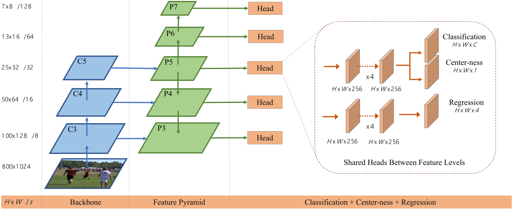
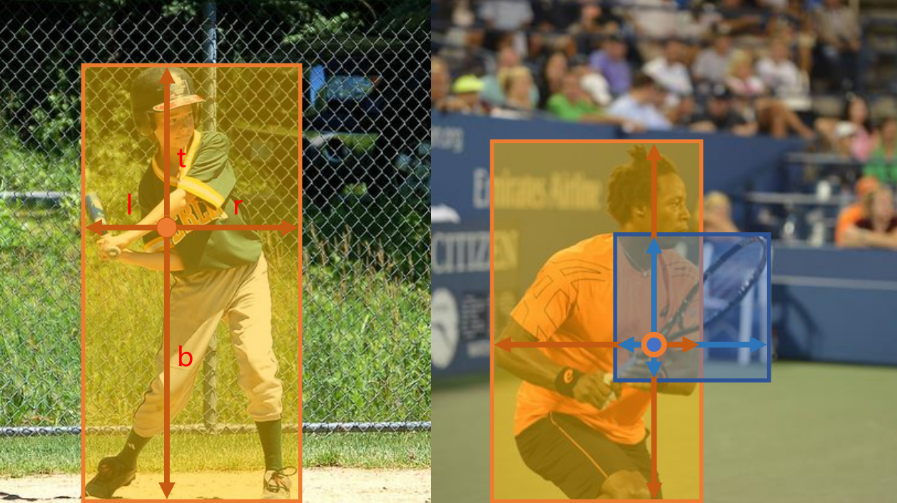

<!--
 * @Date: 2022-01-09 11:17:34
 * @LastEditTime: 2022-01-09 21:21:59
 * @LastEditors: Li Xiang
 * @Description: 
 * @FilePath: \paper_notes\2d_object_detection_and_image_classfication.md
-->

# 2D目标物检测与图片分类

## FCOS

FCOS: Fully Convolutional One-Stage Object Detection

[[abstract](https://arxiv.org/abs/1904.01355)]
[[pdf](https://arxiv.org/pdf/1904.01355)]
[[code](https://github.com/tianzhi0549/FCOS)]

提出一种无锚的目标物检测头，在不同尺度的特征图中，每个像素生成到当前目标物所在检测框上下左右四边的距离(t,b,l,r)来给出proposal。

另外每个像素也回归到对应bbox的中心度，用来滤除离目标物中心距离过远的像素生成的低质量box。

在coco数据集上的精度超过Faster R-CNN与RetinaNet等众多两阶段与单阶段检测算法，推理速度领先 Faster R-CNN 约20%。
## DETR

