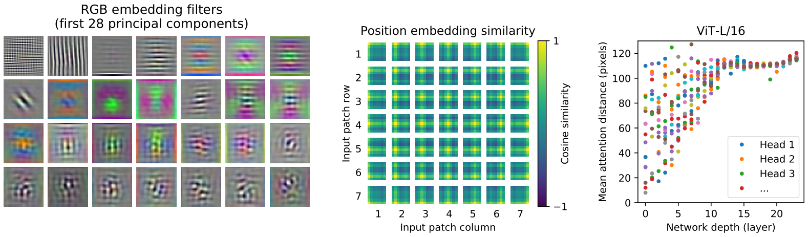

<!--
 * @Date: 2022-01-09 11:17:34
 * @LastEditTime: 2022-01-10 22:35:40
 * @LastEditors: Li Xiang
 * @Description: 
 * @FilePath: \paper_notes\2d_object_detection_and_image_classfication.md
-->
# 2D目标物检测与图片分类

- [2D目标物检测与图片分类](#2d目标物检测与图片分类)
  - [CenterNet](#centernet)
  - [FCOS](#fcos)
  - [ViT](#vit)
  - [DETR](#detr)

## CenterNet

Objects as Points

[[abstract](https://arxiv.org/abs/1904.07850)]
[[pdf](https://arxiv.org/pdf/1904.07850)]
[[code](https://github.com/xingyizhou/CenterNet)]

一种无锚的目标物检测头设计，在heatmap上回归出有目标物的中心点落在各个像素上的置信度，通过heatmap上的局部极大值生成proposal，从而不需要对检测框做NMS后处理。

相比MaskRCNN，YOLOv3等算法，该方法在精度与速度上取得较好的均衡，并可扩充到人体姿态估计，自动驾驶的3D目标物检测等任务上。

对于目标物中心点重叠，进而导致该方法失效的场景，经过统计，在COCO数据集中的出现概率小于0.1%，影响很轻微。

## FCOS

FCOS: Fully Convolutional One-Stage Object Detection

[[abstract](https://arxiv.org/abs/1904.01355)]
[[pdf](https://arxiv.org/pdf/1904.01355)]
[[code](https://github.com/tianzhi0549/FCOS)]

提出一种无锚的目标物检测头，在不同尺度的特征图中，每个像素生成到当前目标物所在检测框上下左右四边的距离(t,b,l,r)来给出proposal。

除此之外，每个像素也回归到对应bbox的中心度，用来滤除离目标物中心距离过远的像素生成的低质量box。

在coco数据集上的精度超过Faster R-CNN与RetinaNet等众多两阶段与单阶段检测算法，推理速度领先 Faster R-CNN 约20%。

## ViT

An Image is Worth 16x16 Words: Transformers for Image Recognition at Scale

[[abstract](https://arxiv.org/abs/2010.11929)]
[[pdf](https://arxiv.org/pdf/2010.11929)]
[[code](https://github.com/google-research/vision_transformer)]

将transformer结构应用到图片分类任务中：将一整张图片分解为若干个图片块，每个patch展开成一维，再通过线性层生成每个图片块的token，像单词序列一样送入transformer，最终在transformer的0号位置进行输出，通过MLP解码出分类结果。

相比其他对比方法，能够达到更高的精度，但需要更多的数据与更多的训练量。

可视化结果表明，token中有效编码了图片块中的低维特征，位置编码学到了图片块间的二维相对位置关系，Transformer关注的尺度(感受野)随层数的增加从近到远。

## DETR

