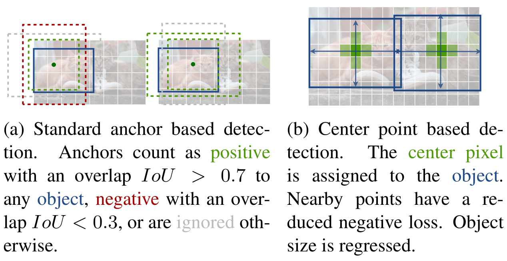
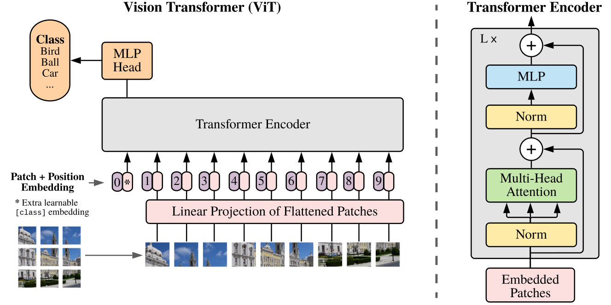

<!--
 * @Date: 2022-01-09 11:17:34
 * @LastEditTime: 2022-01-13 22:40:15
 * @LastEditors: Li Xiang
 * @Description: 
 * @FilePath: \paper_notes\2d_object_detection_and_image_classfication.md
-->
# 2D目标物检测与图片分类

- [2D目标物检测与图片分类](#2d目标物检测与图片分类)
  - [CenterNet](#centernet)
  - [FCOS](#fcos)
  - [ShuffleNet V2](#shufflenet-v2)
  - [ViT](#vit)
  - [DETR](#detr)
  - [Rethinking ImageNet Pre-training](#rethinking-imagenet-pre-training)

## CenterNet

Objects as Points

[[abstract](https://arxiv.org/abs/1904.07850)]
[[pdf](https://arxiv.org/pdf/1904.07850)]
[[code](https://github.com/xingyizhou/CenterNet)]

一种无锚的目标物检测头设计，在heatmap上回归出有目标物中心点落在各个像素上的置信度，通过heatmap上的局部极大值生成proposal，从而不需要对检测框做NMS后处理。

相比MaskRCNN，YOLOv3等算法，该方法在精度与速度上取得较好的均衡，并可扩充到人体姿态估计，自动驾驶的3D目标物检测等任务上。

对于目标物中心点重叠，进而导致该方法失效的场景，经过统计，在COCO数据集中的出现概率小于0.1%，影响很轻微。

## FCOS

FCOS: Fully Convolutional One-Stage Object Detection

[[abstract](https://arxiv.org/abs/1904.01355)]
[[pdf](https://arxiv.org/pdf/1904.01355)]
[[code](https://github.com/tianzhi0549/FCOS)]

提出一种无锚的目标物检测头，在不同尺度的特征图中，每个像素生成到当前目标物所在检测框上下左右四边的距离(t,b,l,r)来给出proposal。

除此之外，每个像素也回归到对应bbox的中心度，用来滤除离目标物中心距离过远的像素生成的低质量box。

在coco数据集上的精度超过Faster R-CNN与RetinaNet等众多两阶段与单阶段检测算法，推理速度领先 Faster R-CNN 约20%。

## ShuffleNet V2

ShuffleNet V2: Practical Guidelines for Efficient CNN Architecture Design

[[abstract](https://arxiv.org/abs/1807.11164)]
[[pdf](https://arxiv.org/pdf/1807.11164)]
[[code](https://github.com/pytorch/vision/blob/5a315453da/torchvision/models/shufflenetv2.py)]

文章指出，FLOPS并不能完全衡量网络推理速度，数据IO时的内存访问成本(MAC, Memory Access Cost)也很影响推理效率。

基于对MAC的分析，提出四个设计高效CNN的实用指导规则：卷积层相等的输入输出通道数量能最小化内存访问成本(卷积尽量不变换通道数)，组卷积分组过多会增加内存访问成本(合理分组卷积)，网络碎片化会降低并行度(网络分支别太多)，逐元素(relu,add,bias等)操作FLOP低却带来大量内存访问成本(规避element wise操作)。

在以上规则指导下，通过通道分离只对一半的通道做卷积，再和未卷积的另一半concat后做channel shuffle，设计了新的网络结构，有准又快。

## ViT

An Image is Worth 16x16 Words: Transformers for Image Recognition at Scale

[[abstract](https://arxiv.org/abs/2010.11929)]
[[pdf](https://arxiv.org/pdf/2010.11929)]
[[code](https://github.com/google-research/vision_transformer)]

将transformer结构应用到图片分类任务中：将一整张图片分解为若干个图片块，每个patch展开成一维，再通过线性层生成每个图片块的token，像单词序列一样送入transformer，最终在transformer的0号位置进行输出，通过MLP解码出分类结果。

相比其他对比方法，能够达到更高的精度，但需要更多的数据与更多的训练量。

可视化结果表明，token中有效编码了图片块中的低维特征，位置编码学到了图片块间的二维相对位置关系，Transformer关注的尺度(感受野)随层数的增加从近到远。

## DETR

## Rethinking ImageNet Pre-training
Rethinking ImageNet Pre-training

[[abstract](https://arxiv.org/abs/1811.08883)]
[[pdf](https://arxiv.org/pdf/1811.08883)]
[[code](https://github.com)]

研究了ImageNet预训练的作用，指出预训练权重在训练早期能加快模型收敛，但在有充足训练数据的前提下，预训练模型并不能提高最终的精度。

在训练数据不足时，预训练模型仍有很大意义。

数据是深度学习的基础。

