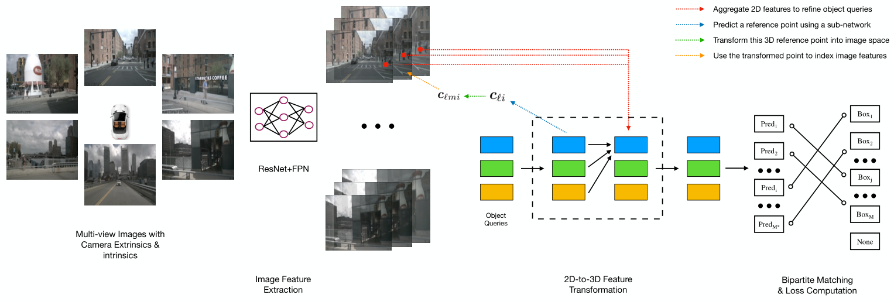
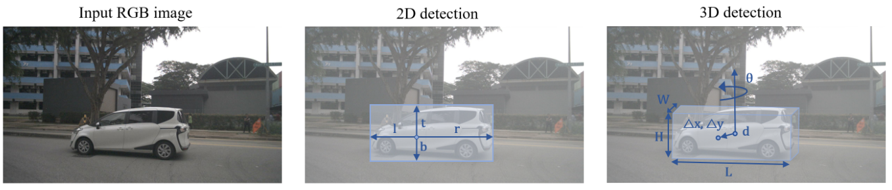
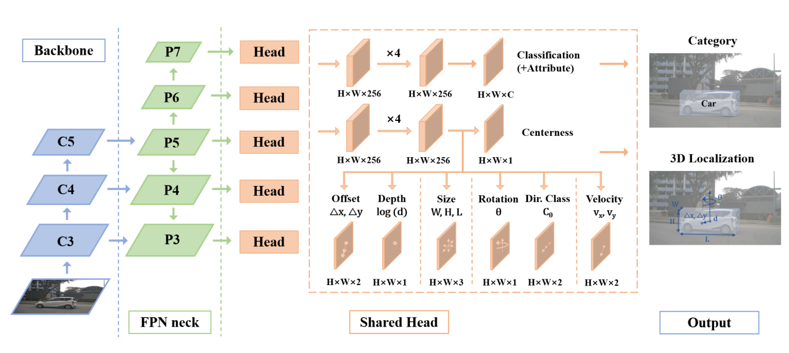
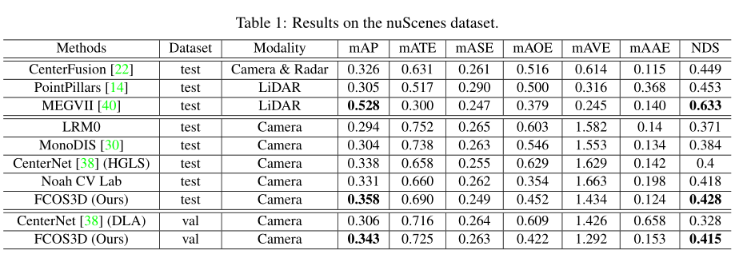
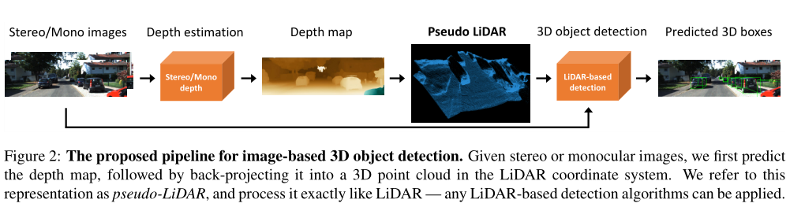
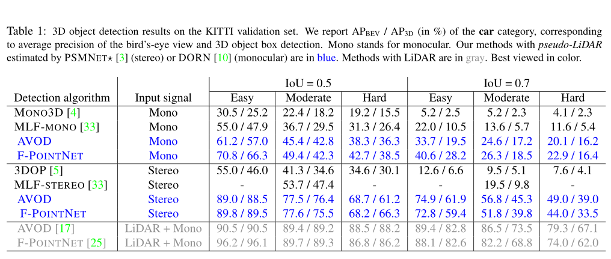
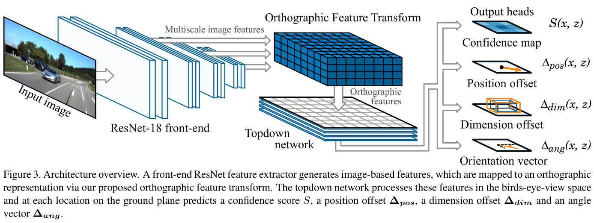
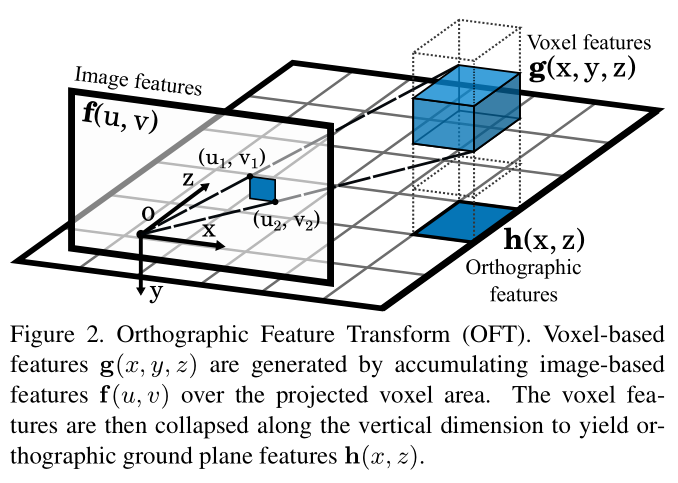
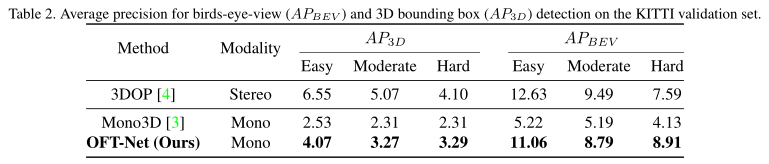

<!--
 * @Date: 2022-01-09 11:17:34
 * @LastEditTime: 2022-01-15 21:27:20
 * @LastEditors: Li Xiang
 * @Description: 
 * @FilePath: \paper_notes\3d_object_detection.md
-->

# 3D目标物检测

- [3D目标物检测](#3d目标物检测)
  - [DETR3D](#detr3d)
  - [FCOS3D](#fcos3d)
  - [Pseudo-LiDAR](#pseudo-lidar)
  - [OFT](#oft)

## DETR3D

DETR3D: 3D Object Detection from Multi-view Images via 3D-to-2D Queries

[[abstract](https://arxiv.org/abs/2110.06922)]
[[pdf](https://arxiv.org/pdf/2104.10956)]
[[code](https://github.com/WangYueFt/detr3d)]

将DETR思想扩展到多相机视觉3D目标物检测任务，生成bev中的检测结果。

使用query产生object proposal，并转换为BEV中的3D point，再投影到像素坐标系中用以关联图像特征。

在nuscenes数据集上超过FCOS3D，达到sota。

## FCOS3D

FCOS3D: Fully Convolutional One-Stage Monocular 3D Object Detection

[[abstract](https://arxiv.org/abs/2104.10956)]
[[pdf](https://arxiv.org/pdf/2104.10956)]
[[code](https://github.com/open-mmlab/mmdetection3d/blob/master/configs/fcos3d/README.md)]

相比2D目标检测的FCOS，改用基于高斯分布的Centerness生成机制。

在位置检测头部分，每个像素上预测目标物3D中心点在图像中投影的相对位置，目标物中心到相机距离，目标物长宽高，旋转角，速度。

最终在Nuscenes上整体精度超过CenterNet，但未给出推理时间。

## Pseudo-LiDAR

Pseudo-LiDAR from Visual Depth Estimation: Bridging the Gap in 3D Object Detection for Autonomous Driving

[[abstract](https://arxiv.org/abs/1812.07179)]
[[pdf](https://arxiv.org/pdf/1812.07179)]
[[code](https://github.com/mileyan/pseudo_lidar)]

认为深度图这种数据表示形式影响了3D目标检测的位置精度。

将单目深度估计或双目相机的结果转换为点云形式，称为伪激光雷达，再利用点云目标检测算法进行处理。

在具体实现中，也进行了2D-3D数据的融合(F-PointNet, AVOD)，精度得到了提高。

## OFT

Orthographic Feature Transform for Monocular 3D Object Detection

[[abstract](https://arxiv.org/abs/1811.08188)]
[[pdf](https://arxiv.org/pdf/1811.08188)]
[[code](https://github.com/tom-roddick/oft)]

提出一种图片特征转BEV的方法。

将空间分为voxel，通过相机内外参计算每个voxel在图片中的投影，将覆盖的区域的2D特征求和作为voxel的特征，最终在BEV中进行目标检测。

在KITTI 3D Object Detection中达到SOTA。

