<!--
 * @Date: 2022-01-23 12:05:34
 * @LastEditTime: 2022-01-26 20:49:18
 * @LastEditors: Li Xiang
 * @Description: 
 * @FilePath: \paper_notes\backbones.md
-->

# 网络主干

- [网络主干](#网络主干)
  - [ResNet 数学推导](#resnet-数学推导)
  - [ResNeXt](#resnext)
  - [MobileNet](#mobilenet)
  - [MobileNetV2](#mobilenetv2)
  - [ShuffleNet V2](#shufflenet-v2)
  - [Rethinking ImageNet Pre-training](#rethinking-imagenet-pre-training)
  - [ViT](#vit)

## ResNet 数学推导

Identity Mappings in Deep Residual Networks

[[abstract](https://arxiv.org/abs/1603.05027)]
[[pdf](https://arxiv.org/pdf/1603.05027)]
[[code](https://github.com/KaimingHe/resnet-1k-layers)]

通过ResNet中网络层梯度的数学推导，说明ResNet易于训练的原因是恒等映射使得其梯度中存在一项1，使得训练时的梯度能够直接传达到任意一层。

通过设计不同shortcut的对比实验，证明了数学推导的有效性。

另外，对ResNet中Conv,BN,Act层的排布顺序进行了探索与优化，提出了更优的pre-activation结构。

(经典作品，数学推导很漂亮，必须精度的论文)

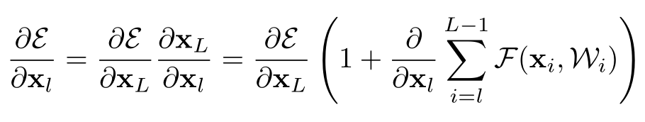

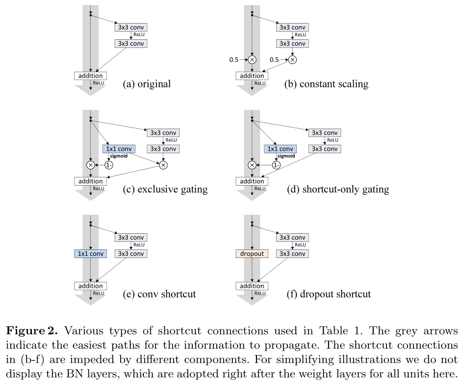

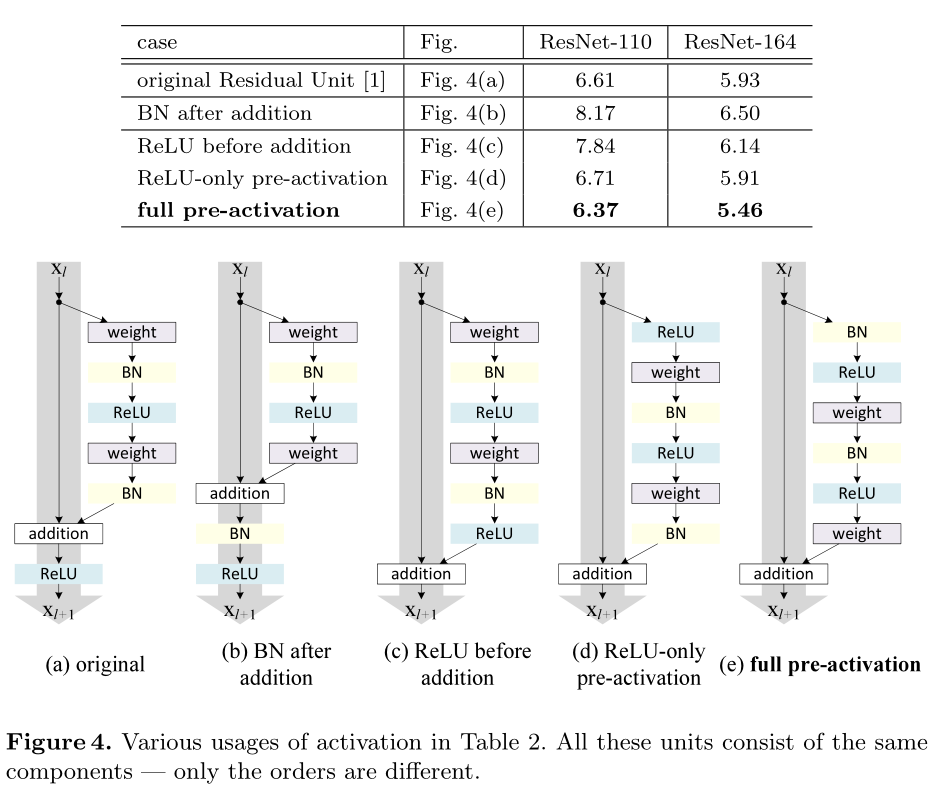

## ResNeXt

Aggregated Residual Transformations for Deep Neural Networks

[[abstract](https://arxiv.org/abs/1611.05431)]
[[pdf](https://arxiv.org/pdf/1611.05431)]
[[code](https://github.com/facebookresearch/ResNeXt)]

在ResNet基础上，提出block内部并行的模块数量(称为cardinality)，也是模型一个重要维度，并设计了新的综合了ResNet和Inception的网络结构，称为ResNeXt。

本质上是将三层卷积的ResBlock中的中间一层换成了分组卷积，用以降低参数和计算量。

(故事讲得很好，也确实有提升，但感觉主要是GroupConv的功劳，命名为ResNeXt略微牵强)

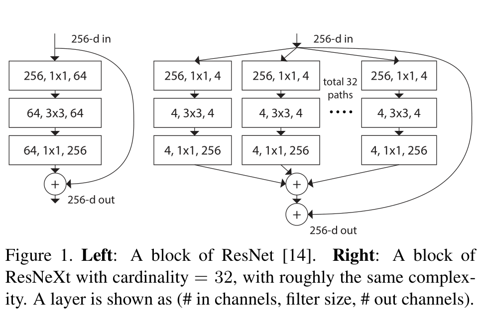

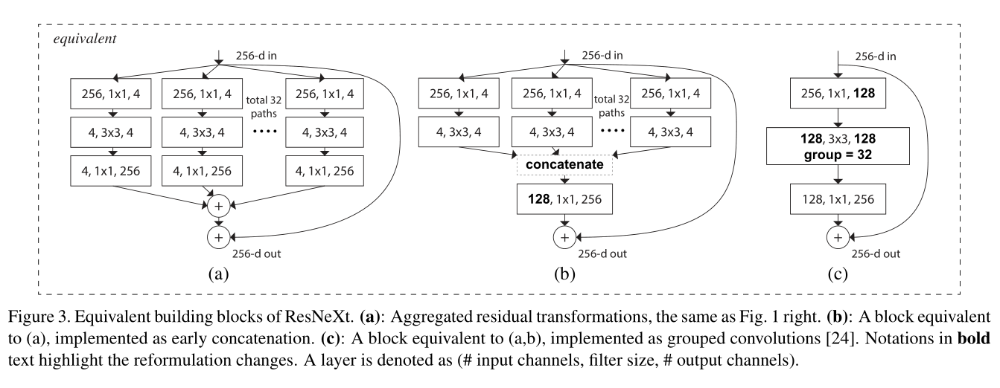

## MobileNet

MobileNets: Efficient Convolutional Neural Networks for Mobile Vision Applications

[[abstract](https://arxiv.org/abs/1704.04861)]
[[pdf](https://arxiv.org/pdf/1704.04861)]
[[code](https://github.com/tensorflow/models/tree/master/research/slim/nets/mobilenet)]

将深度可分离卷积大量应用到网络主干中，并由1x1卷积进行通道间信息流动，从而实现网络轻量化。

对于3x3的卷积，使用MobileNet后网络计算量大约能降低到原来的1/9到1/8。

能显著降低计算量与参数量，精度损失轻微。

(同等FLOP下，DepthwiseConv需要更多的数据IO，用于加载特征以及权重。硬件平台未优化的话容易并发度受限，导致实际效率与FLOP不完全符合，使用时需要注意。)

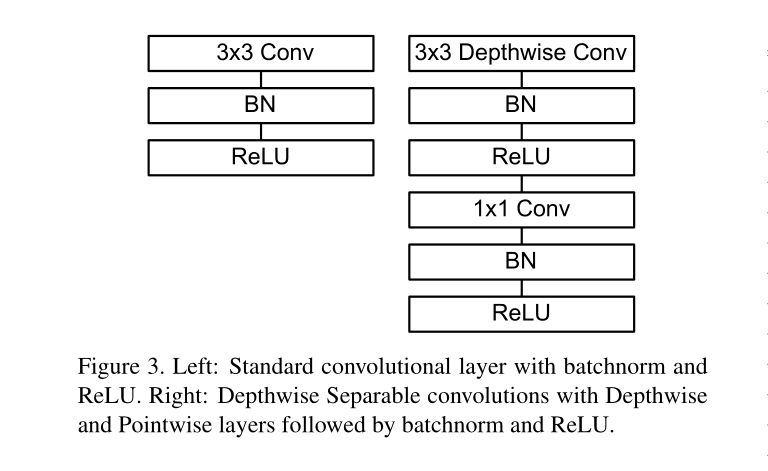

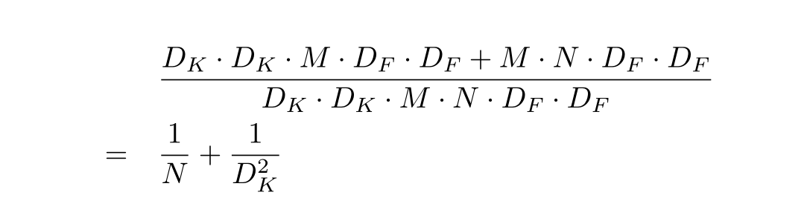

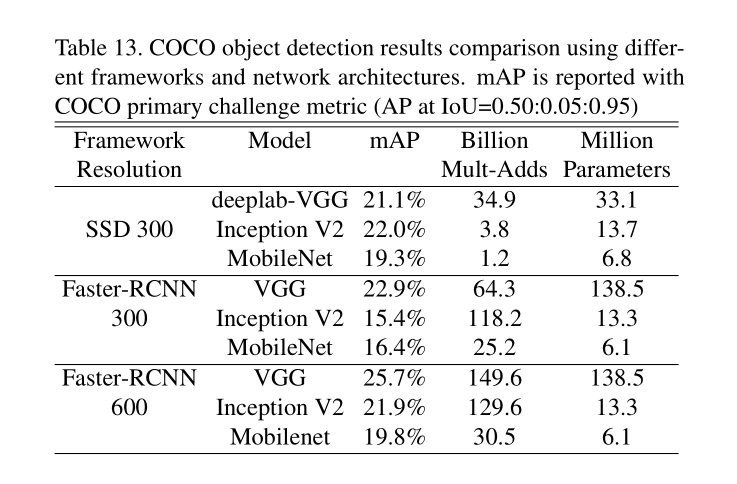

## MobileNetV2

MobileNetV2: Inverted Residuals and Linear Bottlenecks

[[abstract](https://arxiv.org/abs/1801.04381)]
[[pdf](https://arxiv.org/pdf/1801.04381)]
[[code](https://github.com/pytorch/vision/blob/6db1569c89094cf23f3bc41f79275c45e9fcb3f3/torchvision/models/mobilenet.py#L77)]

在MobileNet的基础上，提出倒残差结构，从而进一步提高MobileNet的效果。

区别于bottleneck-resblock的降低计算量的降维-升维策略，此论文提出低维空间的Relu会造成信息损失，故仅在倒残差的高维数据中使用relu，去掉最后一个relu。

效果相比MobileNetV1有明显提高。

(倒残差的结构很经典，也可看做是用DepthWiseConv改造了ResNet。但其实PointWiseConv也可前移到低维，再做DWConv升降维，效果能更好(ConvNext))

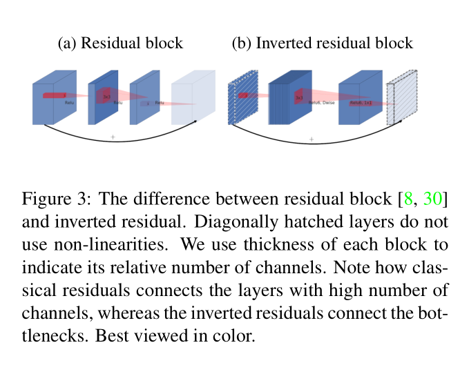

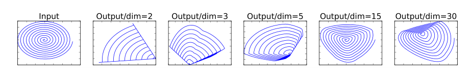

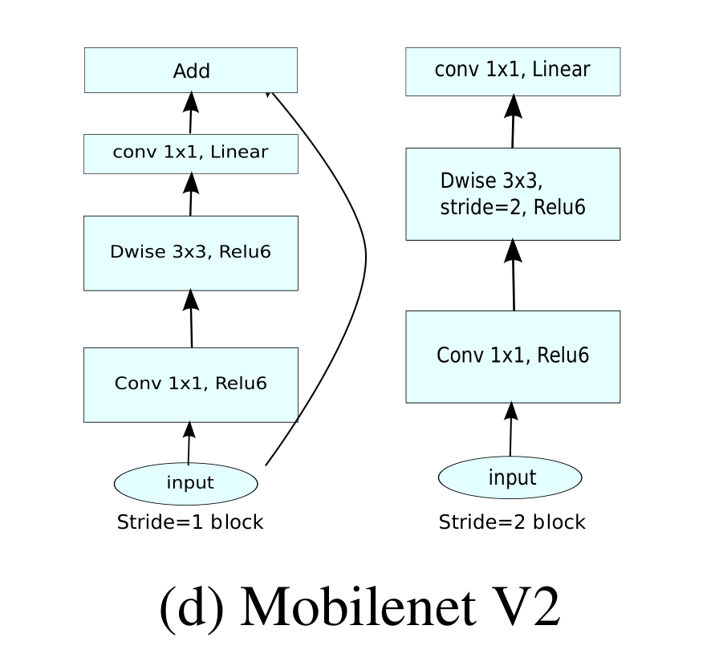

## ShuffleNet V2

ShuffleNet V2: Practical Guidelines for Efficient CNN Architecture Design

[[abstract](https://arxiv.org/abs/1807.11164)]
[[pdf](https://arxiv.org/pdf/1807.11164)]
[[code](https://github.com/pytorch/vision/blob/5a315453da/torchvision/models/shufflenetv2.py)]

文章指出，FLOPS并不能完全衡量网络推理速度，数据IO时的内存访问成本(MAC, Memory Access Cost)也很影响推理效率。

基于对MAC的分析，提出四个设计高效CNN的实用指导规则：卷积层相等的输入输出通道数量能最小化内存访问成本(卷积尽量不变换通道数)，组卷积分组过多会增加内存访问成本(合理分组卷积)，网络碎片化会降低并行度(网络分支别太多)，逐元素(relu,add,bias等)操作FLOP低却带来大量内存访问成本(规避element wise操作)。

在以上规则指导下，通过通道分离只对一半的通道做卷积，再和未卷积的另一半concat后做channel shuffle，设计了新的网络结构，有准又快。

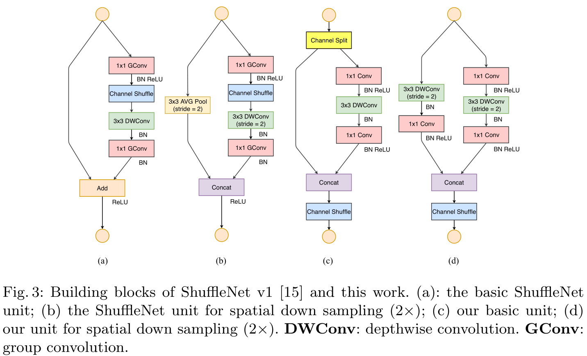

## Rethinking ImageNet Pre-training

Rethinking ImageNet Pre-training

[[abstract](https://arxiv.org/abs/1811.08883)]
[[pdf](https://arxiv.org/pdf/1811.08883)]
[code]

研究了ImageNet预训练的作用，指出预训练权重在训练早期能加快模型收敛，但在有充足训练数据的前提下，预训练模型并不能提高最终的精度。

在训练数据不足时，预训练模型仍有很大意义。

(数据是深度学习的基础)

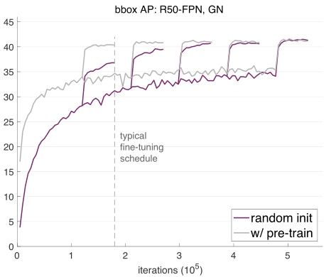

## ViT

An Image is Worth 16x16 Words: Transformers for Image Recognition at Scale

[[abstract](https://arxiv.org/abs/2010.11929)]
[[pdf](https://arxiv.org/pdf/2010.11929)]
[[code](https://github.com/google-research/vision_transformer)]

将transformer结构应用到图片分类任务中：将一整张图片分解为若干个图片块，每个patch展开成一维，再通过线性层生成每个图片块的token，像单词序列一样送入transformer，最终在transformer的0号位置进行输出，通过MLP解码出分类结果。

相比其他对比方法，能够达到更高的精度，但需要更多的数据与更多的训练量。

可视化结果表明，token中有效编码了图片块中的低维特征，位置编码学到了图片块间的二维相对位置关系，Transformer关注的尺度(感受野)随层数的增加从近到远。

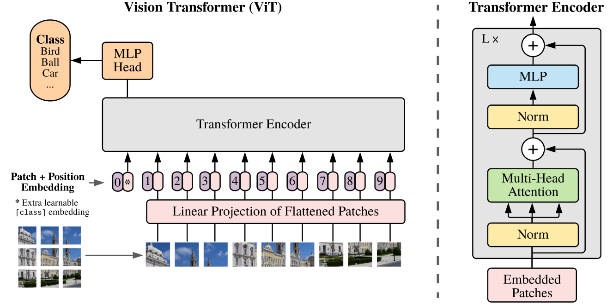

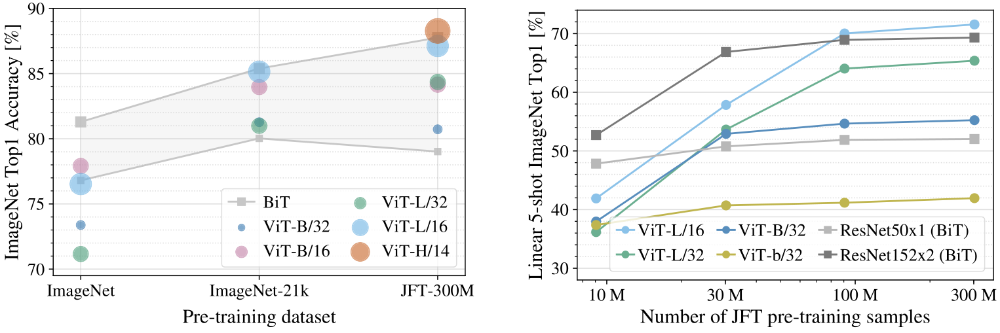

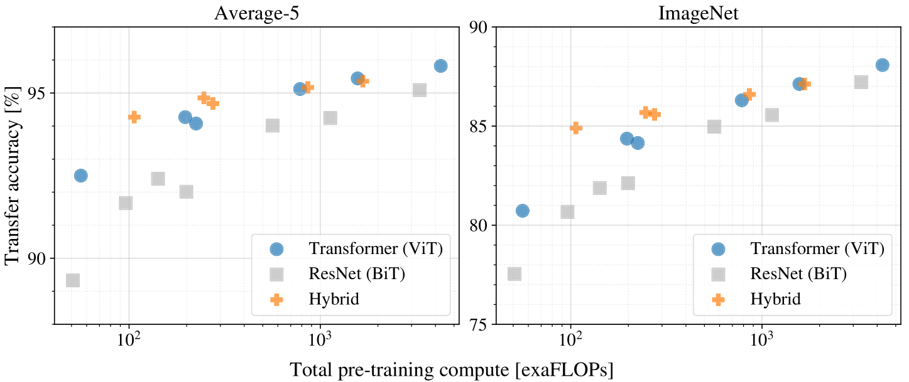

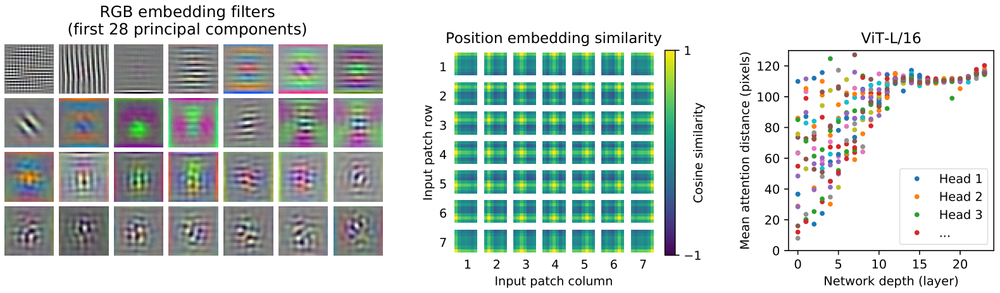
